# Automated Deployment Guide

**FAANG-Standard CI/CD Pipeline for Edge Functions**

This guide shows you how to set up fully automated deployments so you **never need to manually deploy again**.

---

## 🎯 Overview

Once configured, deployments happen automatically:
- ✅ **Push to main** → Auto-deploy edge functions
- ✅ **Pull request merged** → Auto-deploy
- ✅ **Manual trigger** → Deploy on-demand via GitHub UI

---

## 🚀 Quick Start (5 Minutes)

### Option 1: Automated Setup (Recommended)

```bash
# Run the interactive setup script
./scripts/setup-github-secrets.sh
```

The script will:
1. Check prerequisites (GitHub CLI)
2. Prompt for your Supabase access token
3. Configure all GitHub secrets
4. Verify configuration

### Option 2: Manual Setup

Follow the detailed guide: [docs/GITHUB_SECRETS_SETUP.md](GITHUB_SECRETS_SETUP.md)

---

## 📋 What Gets Configured

### GitHub Secrets

| Secret | Value | Purpose |
|--------|-------|---------|
| `SUPABASE_ACCESS_TOKEN` | Your token from Supabase | Authenticates deployments |
| `SUPABASE_PROJECT_ID` | `lnagadkqejnopgfxwlkb` | Identifies your project |

### GitHub Actions Workflow

- **File:** `.github/workflows/deploy-supabase.yml`
- **Triggers:**
  - Push to `main` branch
  - Changes in `supabase/functions/**`
  - Manual workflow dispatch
- **Actions:**
  1. Validate secrets
  2. Link to Supabase project
  3. Deploy all edge functions
  4. Verify deployment

---

## 🔄 How Automated Deployment Works

### Automatic Deployment

```mermaid
graph LR
    A[Push to main] --> B[GitHub detects change]
    B --> C[Run workflow]
    C --> D[Deploy functions]
    D --> E[Verify deployment]
    E --> F[✅ Complete]
```



**Example:**
```bash
# 1. Make changes to edge function
vim supabase/functions/invite-staff-member/index.ts

# 2. Commit and push
git add .
git commit -m "feat: improve error handling"
git push origin main

# 3. GitHub Actions automatically deploys! 🎉
# No manual commands needed
```

### Manual Deployment

1. Go to GitHub repository
2. Click **Actions** tab
3. Select **Deploy Supabase Edge Functions**
4. Click **Run workflow**
5. Select branch (usually `main`)
6. Click **Run workflow** button

---

## 📊 Monitoring Deployments

### View Deployment Status

**Via GitHub Web UI:**
1. Go to your repository
2. Click **Actions** tab
3. See all deployment runs with status:
   - ✅ Green checkmark = Success
   - ❌ Red X = Failed
   - 🟡 Yellow dot = In progress

**Via GitHub CLI:**
```bash
# View recent workflow runs
gh run list --workflow=deploy-supabase.yml --limit 5

# View detailed logs of latest run
gh run view --log
```

### Deployment Logs

Logs show detailed information:
```
🚀 Deploying Edge Functions to Supabase...
Project: lnagadkqejnopgfxwlkb

📡 Linking to Supabase project...
✅ Successfully linked to project

📦 Deploying invite-staff-member...
✅ invite-staff-member deployed

📦 Deploying reset-staff-password...
✅ reset-staff-password deployed

🎉 All edge functions deployed successfully!
```

---

## 🛡️ Security Best Practices

### ✅ Do's

- ✅ Use GitHub Secrets for tokens (encrypted at rest)
- ✅ Rotate access tokens every 90 days
- ✅ Monitor deployment logs for anomalies
- ✅ Use branch protection rules
- ✅ Require pull request reviews

### ❌ Don'ts

- ❌ Never commit tokens to git
- ❌ Don't share tokens in chat/email
- ❌ Don't use personal tokens for production
- ❌ Don't bypass secret validation checks

---

## 🔧 Troubleshooting

### Deployment Failing?

**Check 1: Verify Secrets**
```bash
gh secret list
```

Should show:
```
SUPABASE_ACCESS_TOKEN  Updated YYYY-MM-DD
SUPABASE_PROJECT_ID    Updated YYYY-MM-DD
```

**Check 2: View Error Logs**
```bash
gh run view --log
```

**Check 3: Validate Token**
```bash
# Test token manually
export SUPABASE_ACCESS_TOKEN="your-token"
supabase link --project-ref lnagadkqejnopgfxwlkb
```

### Common Errors

| Error | Cause | Solution |
|-------|-------|----------|
| `Invalid project ref format` | Wrong `SUPABASE_PROJECT_ID` | Should be `lnagadkqejnopgfxwlkb` |
| `Access token not provided` | Missing `SUPABASE_ACCESS_TOKEN` | Run setup script |
| `Authentication failed` | Expired/invalid token | Regenerate token |

---

## 🎓 Advanced Configuration

### Deploy Specific Functions Only

Edit `.github/workflows/deploy-supabase.yml`:

```yaml
# Deploy only invite function
supabase functions deploy invite-staff-member --no-verify-jwt=false
```

### Deploy to Multiple Environments

Create separate workflows:
- `deploy-supabase-staging.yml`
- `deploy-supabase-production.yml`

Use different secrets per environment:
- `SUPABASE_ACCESS_TOKEN_STAGING`
- `SUPABASE_ACCESS_TOKEN_PRODUCTION`

### Add Slack Notifications

Add to workflow:
```yaml
- name: Notify Slack
  if: always()
  uses: slackapi/slack-github-action@v1
  with:
    webhook-url: ${{ secrets.SLACK_WEBHOOK }}
    payload: |
      {
        "text": "Deployment ${{ job.status }}: ${{ github.sha }}"
      }
```

---

## 📚 Related Documentation

- [GitHub Secrets Setup Guide](GITHUB_SECRETS_SETUP.md)
- [Manual Deployment Script](../scripts/deploy-edge-functions.sh)
- [Supabase CLI Docs](https://supabase.com/docs/guides/cli)
- [GitHub Actions Docs](https://docs.github.com/en/actions)

---

## 🆘 Support

**Deployment Issues:**
1. Check GitHub Actions logs
2. Verify secrets configuration
3. Test manual deployment script

**Questions:**
- GitHub Actions: Repository → Issues
- Supabase: https://supabase.com/support

---

## ✅ Verification Checklist

After setup, verify everything works:

- [ ] GitHub secrets configured
- [ ] Push test commit to main
- [ ] GitHub Actions workflow runs
- [ ] Edge functions deployed successfully
- [ ] Can invite staff member via UI
- [ ] Password reset works

---

**Setup time:** 5-10 minutes
**Maintenance:** None (fully automated)
**Cost:** Free (GitHub Actions + Supabase free tier)
